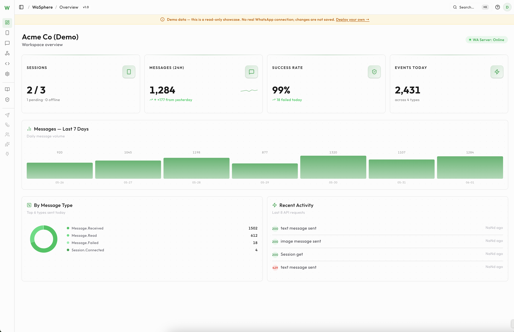

<h1 align="center">WaSphere</h1>

<p align="center">
  <strong>The self-hosted, open-source WhatsApp API platform.</strong><br/>
  Multi-session · multi-webhook · developer-first · MIT licensed.
</p>

<p align="center">
  <a href="#-features">Features</a> •
  <a href="#-quick-start">Quick Start</a> •
  <a href="#-api">API</a> •
  <a href="#-security">Security</a> •
  <a href="#-roadmap">Roadmap</a> •
  <a href="https://demo.wasphere.com">Live Demo ↗</a>
</p>

<p align="center">
  <a href="https://github.com/wasphere/wasphere/actions/workflows/ci.yml"></a>
  
  
  
  
  
  
  
</p>

<p align="center">
  <a href="https://youtu.be/k6tBGIApd8I">
    
  </a>
  &nbsp;&nbsp;
  <a href="https://demo.wasphere.com">
    
  </a>
</p>

<p align="center">
  
</p>

---

## ✨ Why WaSphere?

**WaSphere** is a self-hosted WhatsApp API platform for developers, hosting/WHMCS resellers, and billing systems that want a production-grade WhatsApp gateway they **fully own** — your server, your data, no managed SaaS, no per-message fees, no vendor lock-in.

|                              |                                                                                   |
| ---------------------------- | --------------------------------------------------------------------------------- |
| 🔓 **100% open source**      | MIT licensed. Run it anywhere, fork it, ship it.                                    |
| 🏠 **Self-hosted & private** | Your WhatsApp sessions and contact data never leave your infrastructure.           |
| 🔐 **Security-first**        | HMAC-signed webhooks, scoped API keys, SSRF-guarded delivery, encrypted secrets.    |
| 🖥️ **Developer dashboard**   | Next.js UI for sessions, webhooks, API keys, messaging, audit log + dark mode.     |
| 💬 **14 message types**      | Text, media, buttons, lists, polls, reactions, view-once, location, contacts…       |
| 🐳 **One-command Docker**    | `docker compose up -d` brings up the whole stack with auto-migrations.              |

👉 **Try it live (seeded demo, no signup): [demo.wasphere.com](https://demo.wasphere.com)**

---

## 🏗️ Architecture

WaSphere is two cleanly separated services so the GPL-licensed WhatsApp engine stays isolated from your application layer:

```
┌─────────────────┐   HTTPS    ┌──────────────────┐   internal    ┌────────────────────┐
│  Dashboard UI   │ ─────────▶ │   Dashboard API  │ ────────────▶ │     WA Server      │
│  Next.js (3004) │            │ NestJS · Prisma  │   X-Api-Token │ NestJS · Baileys   │
│  sessions/keys/ │ ◀───────── │  Postgres (3000) │ ◀──────────── │   WhatsApp (3001)  │
│  webhooks UI    │            │  auth · proxy    │               │  the GPL boundary  │
└─────────────────┘            └──────────────────┘               └────────────────────┘
```

- **WA Server** — the WhatsApp gateway (Baileys), the only component that links the GPL engine.
- **Dashboard API** — auth (JWT + scoped API keys), workspaces, webhook fan-out, audit log, and a token-injecting proxy to the WA Server.
- **Dashboard UI** — the management console. Talks only to the Dashboard API; never holds your WA Server token in the browser.

---

## 🎯 Features

### Core

| Feature              | Status | Description                                                |
| -------------------- | :----: | ---------------------------------------------------------- |
| REST API             |   ✅   | Full WhatsApp API over HTTP                                |
| Multi-session        |   ✅   | Run many WhatsApp numbers from one deployment             |
| Web dashboard        |   ✅   | Next.js console with dark mode + WCAG-AA contrast         |
| Built-in API docs    |   ✅   | Interactive Scalar reference on both services             |
| Workspaces           |   ✅   | Isolated config + data per workspace                      |

### Messaging — 14 send types

Every type below has a dedicated REST endpoint and is fully implemented in the WA Server.

| #  | Type        | Notes                                              |
| -- | ----------- | -------------------------------------------------- |
| 1  | Text        | with automatic link previews                       |
| 2  | Image       | with caption, any common format                    |
| 3  | Video       | with caption, streamable                           |
| 4  | Audio       | voice notes (PTT) and audio files                  |
| 5  | Document    | any file type, custom filename                     |
| 6  | Sticker     | static and animated (WebP)                         |
| 7  | GIF         | looping video sent as a GIF                        |
| 8  | View-once   | self-destructing image / video                     |
| 9  | Buttons     | interactive quick-reply buttons                    |
| 10 | List        | interactive menu / list picker                     |
| 11 | Poll        | multi-option polls                                 |
| 12 | Reaction    | emoji reaction to any message                      |
| 13 | Location    | location pins (lat/long + label)                   |
| 14 | Contact     | vCard contact cards                                |

**Delivery & safety:** bulk send with per-recipient outcome tracking · configurable
per-session send delays + auto-read/receipts (anti-ban) · inbound webhooks for every
incoming message and status update.

### Security & Auth

| Feature                       | Status | Notes                                                          |
| ----------------------------- | :----: | -------------------------------------------------------------- |
| Scoped API keys               |   ✅   | up to N keys, 12 permission scopes, **per-session scoping**    |
| HMAC-signed webhooks          |   ✅   | `v1,sha256=` over `timestamp.body`, per-webhook secret, retries |
| SSRF-guarded delivery         |   ✅   | DNS pinning + private-IP denylist on all outbound webhooks     |
| Encrypted secrets at rest     |   ✅   | AES-256-GCM for stored WA Server tokens                        |
| Argon2id + JWT rotation       |   ✅   | timing-safe login, refresh-token rotation + reuse detection    |
| Security headers              |   ✅   | helmet on the API + headers on the UI                          |
| Audit log                     |   ✅   | every API request logged; filterable; 90-day retention         |

### Operations

| Feature              | Status | Notes                                            |
| -------------------- | :----: | ------------------------------------------------ |
| Per-session proxy    |   ✅   | HTTP / HTTPS / SOCKS5 per session                |
| Rate limiting        |   ✅   | sliding-window per session + global throttle     |
| Health checks        |   ✅   | liveness/readiness probes, Kubernetes-ready      |
| One-command Docker   |   ✅   | `docker compose up -d`, migrations auto-run      |
| PostgreSQL 16        |   ✅   | production-grade storage via Prisma              |

---

## 🚀 Quick Start

**Requirements:** Docker Engine 24+ and Docker Compose v2. (For a public deployment, bring your own reverse proxy for TLS — WaSphere does not bundle one.)

```bash
git clone https://github.com/wasphere/wasphere.git
cd wasphere
cp .env.example .env
# Set the secrets in .env — generate each with: openssl rand -hex 32
#   POSTGRES_PASSWORD, JWT_SECRET, ENCRYPTION_KEY, WA_TOKEN,
#   WEBHOOK_SIGNING_SECRET, INTERNAL_WEBHOOK_SECRET
docker compose up -d
```

Then open **http://localhost:3004**, register the first (admin) account, and in **Settings → WA Server** set the URL to `http://wa-server:3001` and your `WA_TOKEN`. Connect a number under **Sessions**, and you're live.

> Full walkthrough: [Quick Start docs](https://wasphere.com/docs/getting-started/quick-start/) · [Configuration reference](./CONFIGURATION.md)

### Services

| Service       | URL                              |
| ------------- | -------------------------------- |
| Dashboard UI  | `http://localhost:3004`          |
| Dashboard API | `http://localhost:3000`          |
| WA Server     | `http://localhost:3001`          |
| API reference | `…:3001/api/reference` (WhatsApp API) · `…:3000/api/reference` (Admin API) |

### Local development

```bash
pnpm install
docker compose -f docker-compose.dev.yml up -d   # Postgres only
pnpm prisma:migrate
pnpm dev                                          # all three packages
```

---

## 📡 API

Requests go through the Dashboard API, which proxies to your WA Server and injects the token. Authenticate with a scoped key: `Authorization: Bearer wsk_…`.

```bash
# Send a text message
curl -X POST https://api.your-domain.com/workspaces/{workspaceId}/proxy/api/sessions/{sessionId}/messages/text \
  -H "Authorization: Bearer wsk_your_key" \
  -H "Content-Type: application/json" \
  -d '{ "to": "12125550100", "text": "Hello from WaSphere!" }'
```

### Send messages with every supported type

```bash
# Send an image
curl -X POST https://api.your-domain.com/workspaces/{workspaceId}/proxy/api/sessions/{sessionId}/messages/image \
  -H "Authorization: Bearer wsk_your_key" \
  -H "Content-Type: application/json" \
  -d '{ "to": "12125550100", "url": "https://cdn.example.com/media/product-launch.jpg", "caption": "Launch poster" }'
```

```bash
# Send a video
curl -X POST https://api.your-domain.com/workspaces/{workspaceId}/proxy/api/sessions/{sessionId}/messages/video \
  -H "Authorization: Bearer wsk_your_key" \
  -H "Content-Type: application/json" \
  -d '{ "to": "12125550100", "url": "https://cdn.example.com/media/demo.mp4", "caption": "Quick walkthrough" }'
```

```bash
# Send an audio file
curl -X POST https://api.your-domain.com/workspaces/{workspaceId}/proxy/api/sessions/{sessionId}/messages/audio \
  -H "Authorization: Bearer wsk_your_key" \
  -H "Content-Type: application/json" \
  -d '{ "to": "12125550100", "url": "https://cdn.example.com/media/voice-note.ogg", "isVoiceNote": true }'
```

```bash
# Send a document
curl -X POST https://api.your-domain.com/workspaces/{workspaceId}/proxy/api/sessions/{sessionId}/messages/document \
  -H "Authorization: Bearer wsk_your_key" \
  -H "Content-Type: application/json" \
  -d '{ "to": "12125550100", "url": "https://cdn.example.com/docs/invoice-042.pdf", "fileName": "invoice-042.pdf", "mimetype": "application/pdf" }'
```

```bash
# Send a sticker
curl -X POST https://api.your-domain.com/workspaces/{workspaceId}/proxy/api/sessions/{sessionId}/messages/sticker \
  -H "Authorization: Bearer wsk_your_key" \
  -H "Content-Type: application/json" \
  -d '{ "to": "12125550100", "url": "https://cdn.example.com/stickers/celebration.webp" }'
```

```bash
# Send a GIF
curl -X POST https://api.your-domain.com/workspaces/{workspaceId}/proxy/api/sessions/{sessionId}/messages/gif \
  -H "Authorization: Bearer wsk_your_key" \
  -H "Content-Type: application/json" \
  -d '{ "to": "12125550100", "url": "https://cdn.example.com/media/launch-loop.mp4", "caption": "It loops as a GIF in chat" }'
```

```bash
# Send a view-once image or video
curl -X POST https://api.your-domain.com/workspaces/{workspaceId}/proxy/api/sessions/{sessionId}/messages/view-once \
  -H "Authorization: Bearer wsk_your_key" \
  -H "Content-Type: application/json" \
  -d '{ "to": "12125550100", "url": "https://cdn.example.com/media/quote.png", "caption": "Open once" }'
```

```bash
# Send a buttons message
curl -X POST https://api.your-domain.com/workspaces/{workspaceId}/proxy/api/sessions/{sessionId}/messages/buttons \
  -H "Authorization: Bearer wsk_your_key" \
  -H "Content-Type: application/json" \
  -d '{ "to": "12125550100", "text": "Choose a delivery window", "footer": "Reply with a button", "buttons": [{ "id": "delivery_morning", "text": "Morning" }, { "id": "delivery_afternoon", "text": "Afternoon" }, { "id": "delivery_evening", "text": "Evening" }] }'
```

```bash
# Send a list message
curl -X POST https://api.your-domain.com/workspaces/{workspaceId}/proxy/api/sessions/{sessionId}/messages/list \
  -H "Authorization: Bearer wsk_your_key" \
  -H "Content-Type: application/json" \
  -d '{ "to": "12125550100", "title": "Choose your plan", "text": "Please select an option from the list below.", "buttonText": "View plans", "sections": [{ "title": "Monthly plans", "rows": [{ "id": "starter", "title": "Starter", "description": "Up to 1,000 messages" }, { "id": "growth", "title": "Growth", "description": "Up to 10,000 messages" }] }] }'
```

```bash
# Send a poll
curl -X POST https://api.your-domain.com/workspaces/{workspaceId}/proxy/api/sessions/{sessionId}/messages/poll \
  -H "Authorization: Bearer wsk_your_key" \
  -H "Content-Type: application/json" \
  -d '{ "to": "12125550100", "name": "Which reminder cadence works best?", "options": ["Daily", "Twice a week", "Weekly"], "selectableCount": 1 }'
```

```bash
# React to an existing message
curl -X POST https://api.your-domain.com/workspaces/{workspaceId}/proxy/api/sessions/{sessionId}/messages/reaction \
  -H "Authorization: Bearer wsk_your_key" \
  -H "Content-Type: application/json" \
  -d '{ "to": "12125550100", "messageId": "3EB0123456789ABCDEF0", "emoji": "👍" }'
```

```bash
# Send a location pin
curl -X POST https://api.your-domain.com/workspaces/{workspaceId}/proxy/api/sessions/{sessionId}/messages/location \
  -H "Authorization: Bearer wsk_your_key" \
  -H "Content-Type: application/json" \
  -d '{ "to": "12125550100", "latitude": 37.7749, "longitude": -122.4194, "name": "San Francisco Office", "address": "1 Market St, San Francisco, CA 94105" }'
```

```bash
# Send a contact card
curl -X POST https://api.your-domain.com/workspaces/{workspaceId}/proxy/api/sessions/{sessionId}/messages/contact \
  -H "Authorization: Bearer wsk_your_key" \
  -H "Content-Type: application/json" \
  -d '{ "to": "12125550100", "displayName": "Alex Morgan", "phoneNumber": "+1 415 555 2671" }'
```

```bash
# Register a signed webhook
curl -X POST https://api.your-domain.com/workspaces/{workspaceId}/webhooks \
  -H "Authorization: Bearer wsk_your_key" \
  -H "Content-Type: application/json" \
  -d '{ "name": "n8n", "url": "https://n8n.example.com/webhook/wa", "events": ["message.received"] }'
```

Every delivery is signed: `X-WaSphere-Signature: v1,sha256=<hmac>` over `{timestamp}.{rawBody}`.

**Interactive API reference** — every endpoint, request/response schema, and try-it-out console ships built-in on both services (at `/docs/wa-server` and `/docs/admin` on your own deployment). Explore them live:

- 📘 **[WA Server API](https://app.wasphere.com/docs/wa-server)** — sessions, messages (all 14 types), contacts, groups
- 📗 **[Dashboard / Admin API](https://app.wasphere.com/docs/admin)** — auth, workspaces, API keys, webhooks, proxy

---

## 🔐 Security

- **No vendor trust required** — sessions and contacts live only on your infrastructure.
- **Scoped, hashed API keys** — 12 permission scopes plus optional per-session scoping; keys stored Argon2id-hashed, shown once.
- **Signed webhooks with SSRF protection** — HMAC-SHA256 signatures, per-webhook secrets, exponential-backoff retries, auto-deactivation; outbound delivery is DNS-pinned and blocks private/loopback/link-local/cloud-metadata targets.
- **Secrets encrypted at rest** — AES-256-GCM for WA Server tokens; secrets only via environment variables, never committed.
- **Hardened auth** — Argon2id passwords, timing-safe login, JWT refresh-token rotation with reuse detection, registration locks after the first admin.
- **Header-only WA token + proxy stripping** — the WA Server token is accepted via `X-Api-Token` only and is stripped from all proxied responses, so it never reaches the browser.

Found a vulnerability? See [CONTRIBUTING.md](./CONTRIBUTING.md) for responsible disclosure.

---

## 🛠 Tech Stack

| Layer        | Technology                                  |
| ------------ | ------------------------------------------- |
| WA Server    | NestJS · TypeScript · Baileys (pinned 6.7.21) |
| Dashboard API| NestJS · Prisma · PostgreSQL 16             |
| Dashboard UI | Next.js 16 · TailwindCSS · ShadCN UI        |
| Auth         | JWT + Argon2id · scoped API keys            |
| Monorepo     | pnpm workspaces                             |
| Container    | Docker + Docker Compose                     |

---

## 📁 Project Structure

```
wasphere/
├── packages/
│   ├── wa-server/        # WhatsApp gateway (NestJS + Baileys) — the GPL boundary
│   ├── dashboard-api/    # NestJS + Prisma API: auth, workspaces, webhooks, proxy
│   └── dashboard-ui/     # Next.js dashboard
├── docker-compose.yml        # portable full stack (self-host)
├── docker-compose.dev.yml    # Postgres only (local dev)
├── docker-compose.prod.yml   # Dokploy/Traefik overlay
├── docker-compose.demo.yml   # DEMO_MODE showcase (demo.wasphere.com)
├── CONFIGURATION.md
└── README.md
```

---

## 🗺️ Roadmap

### v1.1
- Inbox UI — receive messages and view threads in the dashboard
- Rich per-message-type phone preview
- Per-webhook recent-events log + custom signing secret input
- New-workspace onboarding checklist + real-time Overview event ticker

### v1.5
- MySQL / SQLite support (PostgreSQL-only today)
- Full message log with search & filter
- Workspace rename · real-time WebSocket events
- Multiple workspaces per deployment

### v2.0 — WaSphere Pro
- Campaigns, Automations, CRM & Inbox, AI replies
- Email/SMS notifications, multi-language SDK snippets
- First-class WHMCS integration · premium support

> Have a request? [Open an issue](https://github.com/wasphere/wasphere/issues).

---

## 📚 Documentation

| Resource                                                                   | Description                       |
| -------------------------------------------------------------------------- | --------------------------------- |
| [Quick Start](https://wasphere.com/docs/getting-started/quick-start/)      | Deploy + first message in ~10 min |
| [Installation](https://wasphere.com/docs/getting-started/installation/)    | Every service & port explained    |
| [Configuration](./CONFIGURATION.md)                                        | Full environment reference        |
| [WHMCS integration](https://wasphere.com/docs/guides/whmcs-integration/)   | Order/invoice WhatsApp alerts      |
| [Webhooks](https://wasphere.com/docs/concepts/webhooks/)                   | Real-time events + signatures      |

---

## 🤝 Contributing

1. **Fork** the repo and create a branch (`git checkout -b feature/amazing-feature`)
2. **Commit** your changes (Conventional Commits; include `Closes #N`)
3. **Push** and open a Pull Request

See [CONTRIBUTING.md](./CONTRIBUTING.md) for setup, branch naming, and PR guidelines.

---

## 📄 License

**MIT** — free for personal and commercial use. See [LICENSE](./LICENSE).

> The WA Server links [Baileys](https://github.com/WhiskeySockets/Baileys), which depends on `libsignal` (GPLv3). WaSphere isolates all Baileys code in the WA Server binary; the rest of the platform stays MIT-clean.

---

<div align="center">
  <strong>WaSphere</strong> — own your WhatsApp infrastructure.<br/>
  <a href="https://wasphere.com">Website</a> ·
  <a href="https://demo.wasphere.com">Live Demo</a> ·
  <a href="https://github.com/wasphere/wasphere/issues">Issues</a> ·
  <a href="https://wasphere.com/docs/">Docs</a>
  <br/><br/>
  <sub>Made with ❤️ by <a href="https://waqasahmedwaseer.com">Waqas Ahmed Waseer</a></sub><br/>
  <sub>Hosting by <a href="https://waseerhost.com">WaseerHost</a> · Not affiliated with WhatsApp Inc. or Meta.</sub>
</div>
